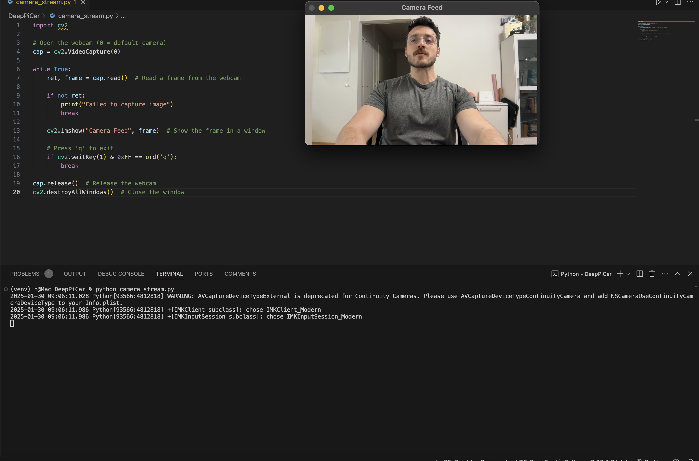
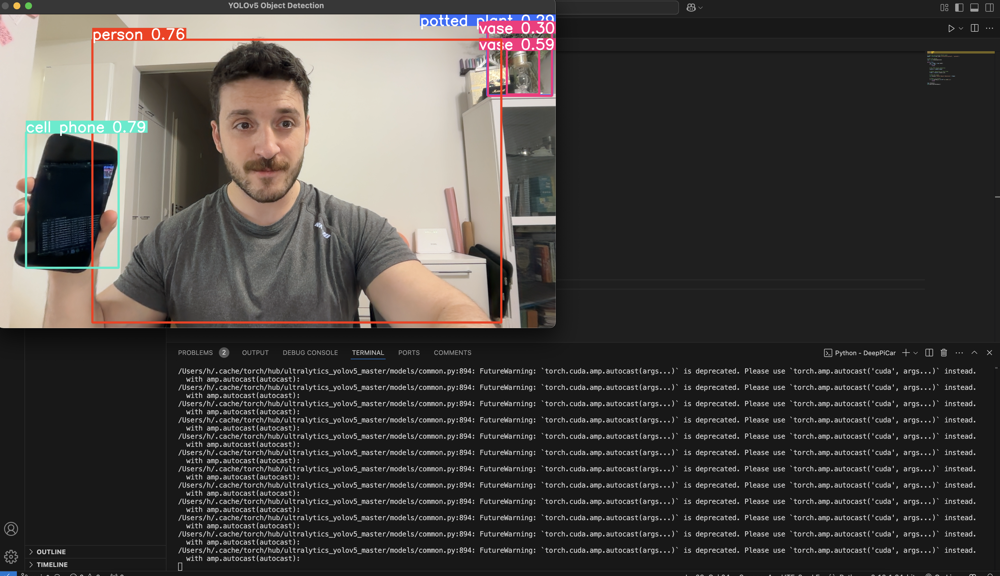
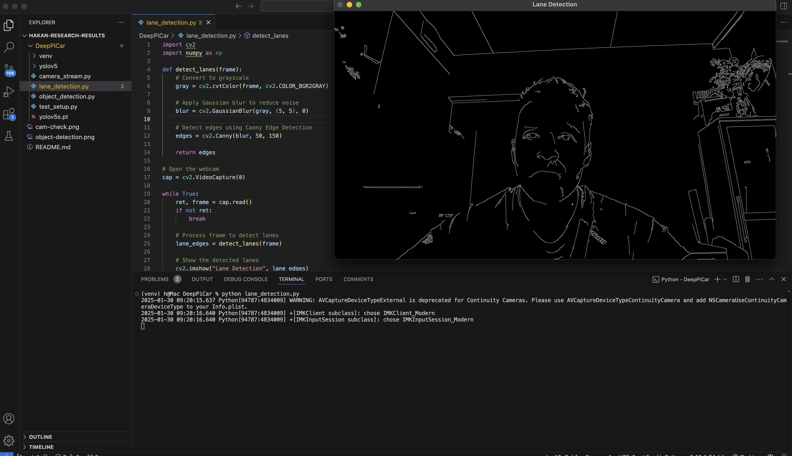

# 🚗 DeepPiCar Research Results

This project is a **beginner-friendly AI vision system** for a self-driving car using **OpenCV and YOLOv5**.  
It includes:
- ✅ **Camera Setup** – Ensuring your webcam works.
- ✅ **Real-Time Object Detection** – Detecting objects using YOLOv5.
- ✅ **Lane Detection** – Identifying road lane markings using OpenCV.

By following this guide, you can **clone this repo, install dependencies, and run each script step by step**.

---

## ⚡ 1️⃣ Clone This Repository & Set Up Virtual Environment
```bash
# Clone the repository
git clone https://github.com/yourusername/hakan-research-results.git
cd hakan-research-results

# Install Python 3.10 (if not installed)
brew install python@3.10  # For macOS
# Windows users: Download from python.org

# Create and activate a virtual environment
python3 -m venv venv
source venv/bin/activate  # macOS/Linux
# or
venv\Scripts\Activate  # Windows

# Upgrade pip and install dependencies
pip install --upgrade pip
pip install torch torchvision opencv-python opencv-python-headless ultralytics
```

---

## 📸 2️⃣ Test Camera Setup
```bash
# Run camera feed test
python camera_stream.py
```
This should **open a window showing your live camera feed**.  
If the camera is detected, you should see yourself on the screen.

**Press `q` to exit.**



---

## 🎯 3️⃣ Run Object Detection (YOLOv5)
```bash
# Clone YOLOv5 and install dependencies
git clone https://github.com/ultralytics/yolov5.git
cd yolov5
pip install -r requirements.txt
cd ..

# Run YOLOv5 object detection
python object_detection.py
```
This will **detect objects like people, phones, and laptops**, drawing **bounding boxes around them**.

**Press `q` to exit.**



---

## 🛣️ 4️⃣ Run Lane Detection
```bash
# Run lane detection
python lane_detection.py
```
This will highlight **lane edges** in white on a black background. Btw hat's a sad 🙁 face there. Yeah it can detect even the lanes of a sad face 😅

**Press `q` to exit.**



---

## ✅ 5️⃣ Troubleshooting
### Camera Not Working?
- Try changing `cv2.VideoCapture(0)` to `cv2.VideoCapture(1)` in `camera_stream.py`.

### YOLOv5 Not Detecting Objects?
- Ensure you've installed YOLOv5 dependencies:
  ```bash
  git clone https://github.com/ultralytics/yolov5.git
  cd yolov5
  pip install -r requirements.txt
  cd ..
  ```

---

## 🚀 6️⃣ Next Steps
Now that object detection and lane detection are working:
1. 🎯 **Combine Object & Lane Detection** in a single script.  
2. 🔧 **Control a car’s movement** based on detections.  
3. 🖥 **Build a web-based control panel** (like a Tesla UI).  

Stay tuned for more updates!

---

### 💡 Credits
Developed as part of **DeepPiCar** by **Hakan Asmaoglu**.

---
